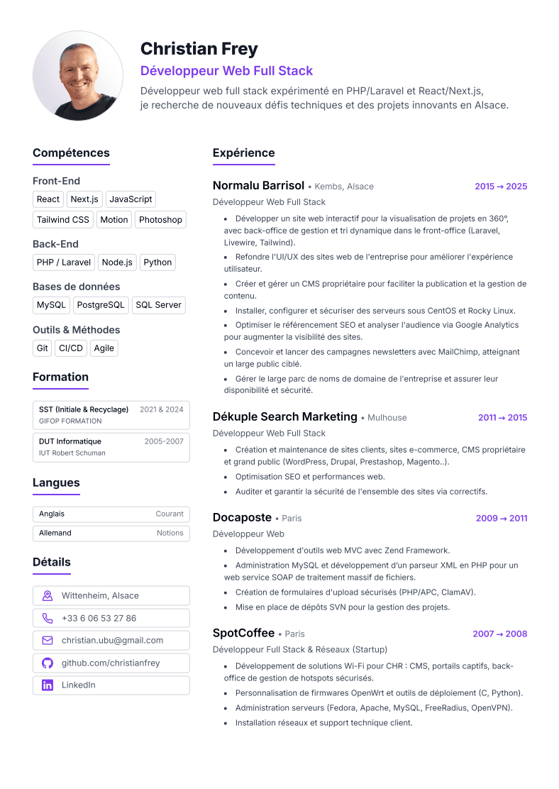

# Resume

A modern, responsive personal resume website built with Tailwind CSS and Puppeteer for PDF generation.

⭐ Don't forget to star this repo if you find it helpful!

## Preview

[View Live Resume](https://christianfrey.github.io/resume/) | [Download PDF](https://christianfrey.github.io/resume/resume.pdf)

<p align="center">
  <a href="https://christianfrey.github.io/resume/">
    
  </a>
  <br>
  <em>Click the preview to view the live resume</em>
</p>

## Tech Stack

| Technology                                            | Purpose                                  |
| ----------------------------------------------------- | ---------------------------------------- |
| [Vite](https://vite.dev/)                             | Build Tool & Dev Server                  |
| [Tailwind CSS](https://tailwindcss.com/)              | Utility-first CSS framework              |
| [Prettier](https://prettier.io/)                      | Code formatting + Tailwind class sorting |
| [Puppeteer](https://pptr.dev/)                        | PDF Generation                           |
| [GitHub Pages](https://pages.github.com/)             | Static Site Hosting                      |
| [GitHub Actions](https://github.com/features/actions) | CI/CD Pipeline                           |

## Quick Start

### Prerequisites

- Node.js (v18+)
- npm or yarn

### Installation

```bash
# Clone the repository
git clone https://github.com/christianfrey/resume.git

# Navigate to project directory
cd resume

# Install dependencies
npm install

# Start development server
npm run dev
```

### Export PDF with Puppeteer

```bash
npm run generate:pdf
```

## Deployment

The project automatically deploys to GitHub Pages when code is pushed to the `main` branch using GitHub Actions:

1. **Push to `main`** → Triggers build workflow
2. **Build Process** → Vite builds the project + Puppeteer generates PDF
3. **Deploy** → Static files deployed to GitHub Pages
4. **Live** → Resume accessible at your GitHub Pages URL

### Manual Deployment

```bash
npm run build
npm run generate:pdf
# Deploy dist/ folder to your hosting provider
```

## Customization

### Updating Content

- Edit `index.html` to update resume content
- Modify Tailwind classes and `src/style.css` for styling changes
- Add images to `public/`

### PDF Styling

- Adjust print styles in CSS with Tailwind `print:` classes

## Contributing

This is a personal resume project, but feel free to:

- Report bugs or suggest improvements via issues
- Fork the project as inspiration for your own resume
- Share feedback on the design or code structure
